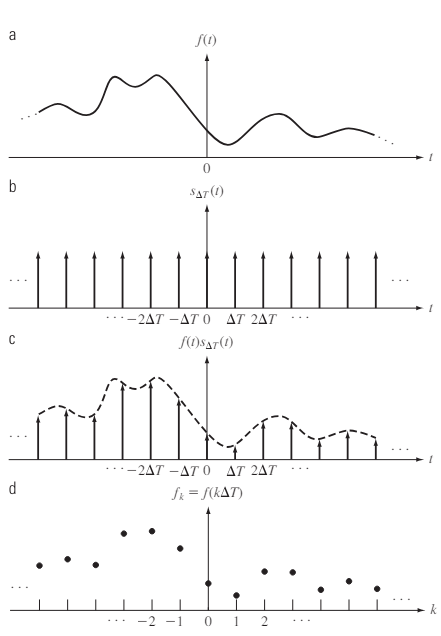
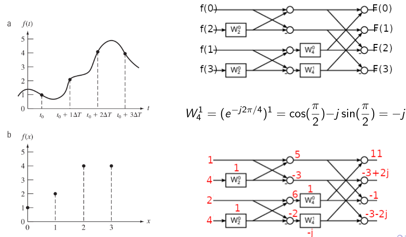

# Filtragem no domínio da frequência

## Fundamentos

A função da base é a soma das quatro funções ao lado. Em 1807 a ideia de Fourier, que as funções periódicas podem ser representadas como uma soma ponderada de senos e cossenos foi recebida com ceticismo.

## Amostragem e a transformada de Fourier de funções amostradas

### Amostragem

(a) Função contínua. (b) Trem de impulsos utilizado para modelar o processo de amostragem. (c) Função amostrada formada pelo produto de (a) e (b). (d) Amostras obtidas pela integração e pelo uso da propriedade de peneiramento do impulso. (A linha tracejada em (c) foi incluída para referência. Ela não faz parte dos dados).

## A transformada rápida de Fourier (FFT)

A FFT tem complexidade da ordem de MN log₂MN. Para uma imagem de 1024x1024 pixels, implica em 20 milhões de multiplicações e adições. Uma redução substancial.

Uma restrição é que M tem que ser potência de 2. O termo mais trivial fn que não depende de k é dado por (exemplo): F
piipiipipiiipi...ii
k = fn, onde p = par e i = ímpar. Se substituirmos os p’s e os i’s por 0’s e 1’s, respectivamente, obtemos um número binário. O valor de n é exatamente este número com a ordem dos bits invertida. A reordenação dos termos, considerando a ordem em que os cálculos devem ser realizados a partir dos termos triviais, otimiza os cálculos da transformada de Fourier.

## Esquema Butterfly

